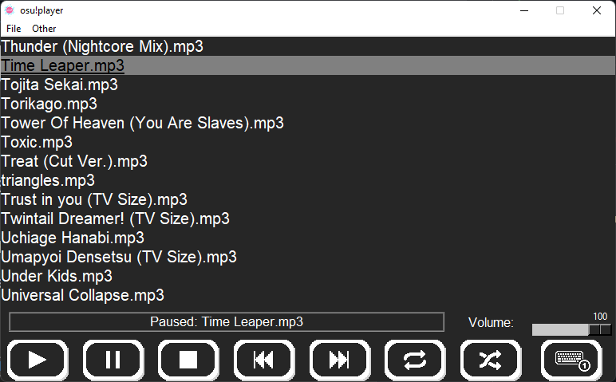

# Osu!MusicPlayer for Windows

A music player that import automatically your osu! songs

With a Discord activity status !

*Written in Python , uses Python 3.10*

# How to install :

- Install **ffmpeg** and add it to **`PATH`**. You can find a tutorial **[here](https://www.geeksforgeeks.org/how-to-install-ffmpeg-on-windows/).** (Steps 1-4)

- Download the installer

- Click on `More info` and `Run anyway` if a window "Windows protected your pc" poped up (it's not a virus you can check the code [here](https://github.com/OJddJO/osu-music-player/tree/main/osu!player))

*To disable this window: Go to **Start > Settings > Security > App and Browser Control > Reputation-based protection settings and then disable it** (the option is quite unecessary because there is something called antivirus)*

- Launch the installer and follow the instructions

*It is normal if there is a cmd that popup*

# Keybindings:

- `ctrl + alt + space` : **Play/Pause**

- `ctrl + alt + left/right` : **Previous/Next**

- `ctrl + alt + up/down` : **Volume**

# Version :

-V4.6 : Optimized Discord RPC

-V4.5 : Better Search algorithm

-V4.4 : Bug Fix

-V4.3 : Bug Fix, Optimization

-V4.2 : Bug Fix

-V4.1 : Added Check for updates

-V4.0 : Added Search Bar, Major improvement, Optimization

-V3.3 : Bug Fix

-V3.2 : Bug Fix

-V3.1 : You can now choose the folder where you want to install the app

-V3.0 : Major improvement (importSongs)
