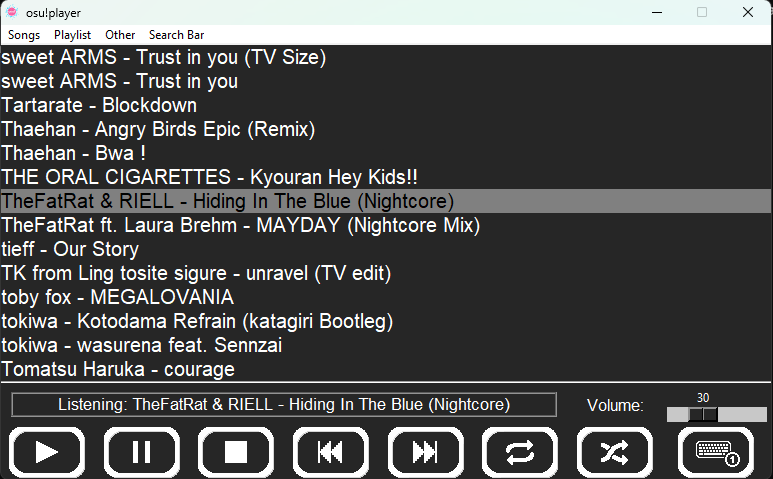
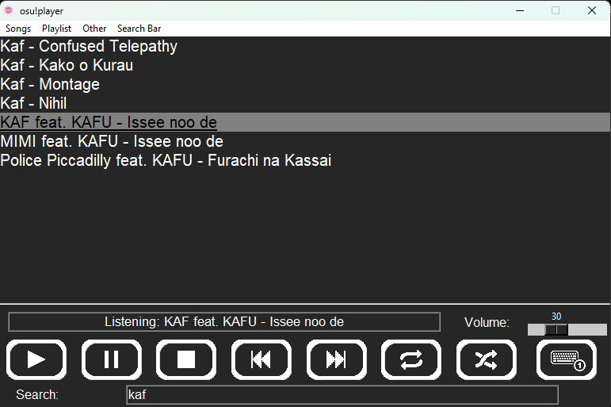

# Osu!MusicPlayer for Windows

A music player that import automatically your osu! songs

With a Discord activity status !

*Written in Python , uses Python 3.10*

# How to install :

- Install **ffmpeg** and add it to **`PATH`**. You can find a tutorial **[here](https://www.geeksforgeeks.org/how-to-install-ffmpeg-on-windows/).** (Steps 1-4)

- Download the installer

- Launch the installer

- Click on `More info` and `Run anyway` if a window "Windows protected your pc" poped up (the app is safe, you can check the source code [here](https://github.com/OJddJO/osu-music-player/tree/main/osu!player))

*To disable this window: Go to **Start > Settings > Security > App and Browser Control > Reputation-based protection settings and then disable it** (the option is quite unecessary because there is something called antivirus)*

- Follow the instructions

*It is normal if there is a cmd that popup*

# Keybindings:

- `ctrl + alt + space` : **Play/Pause**

- `ctrl + alt + left/right` : **Previous/Next**

- `ctrl + alt + up/down` : **Volume**

# Version :

-V6.1: Bug fix

-V6.0: Added in-app song downloader

-V5.12 : Optimization

-V5.11 : Error message

-V5.10 : Bug Fix

-V5.9 : Bug Fix

-V5.8 : Added loop one song, focus on search bar when toggled

-V5.7 : Bug fix

-V5.6 : Bug fix

-V5.5 : Bug fix

-V5.4 : Better algorithm to name songs

-V5.3 : Better algorithm to name songs

-V5.2 : Better import

-V5.1 : Bug fix (playlist not working well)

-V5.0 : Added playlist system, major improvment

-V4.8 : Added double click to play

-V4.7 : Save the last volume level

-V4.6 : Optimized Discord RPC

-V4.5 : Better Search algorithm

-V4.4 : Bug Fix

-V4.3 : Bug Fix, Optimization

-V4.2 : Bug Fix

-V4.1 : Added Check for updates

-V4.0 : Added Search Bar, Major improvement, Optimization
