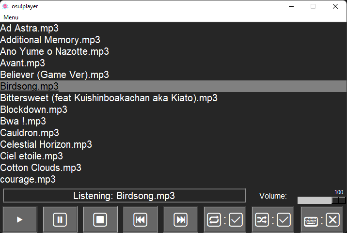

# Osu!MusicPlayer for Windows

A music player that import automatically your osu! songs

*Written in Python , uses Python 3.10*

# How to install :

- Install **ffmpeg** and add it to **PATH**. You can find a tutorial **[here](https://www.geeksforgeeks.org/how-to-install-ffmpeg-on-windows/).**

- Download the .zip file and unzip it.

- Copy the *osu!player* directory into your *Music* directory

- Launch **osu!player** in the *osu!player* directory to run the app 

*It is normal if there are some cmd that popup*

# Version :

-V2.8 : Better import

-V2.7 : Added re-import all songs in Menu

-V2.6 : Better keyboard input (Ctrl+Alt+Space, Ctrl+Alt+Arrows)

-V2.5 : Keyboard Input (Space = Play/Pause, Arrows = Next/Previous)

-V2.4 : Improved Buttons

-V2.3 : Better import

-V2.2 : Better "Previous" script

-V2.1 : Added Volume control

-V2.0 : Better UI, Added Shuffle option
